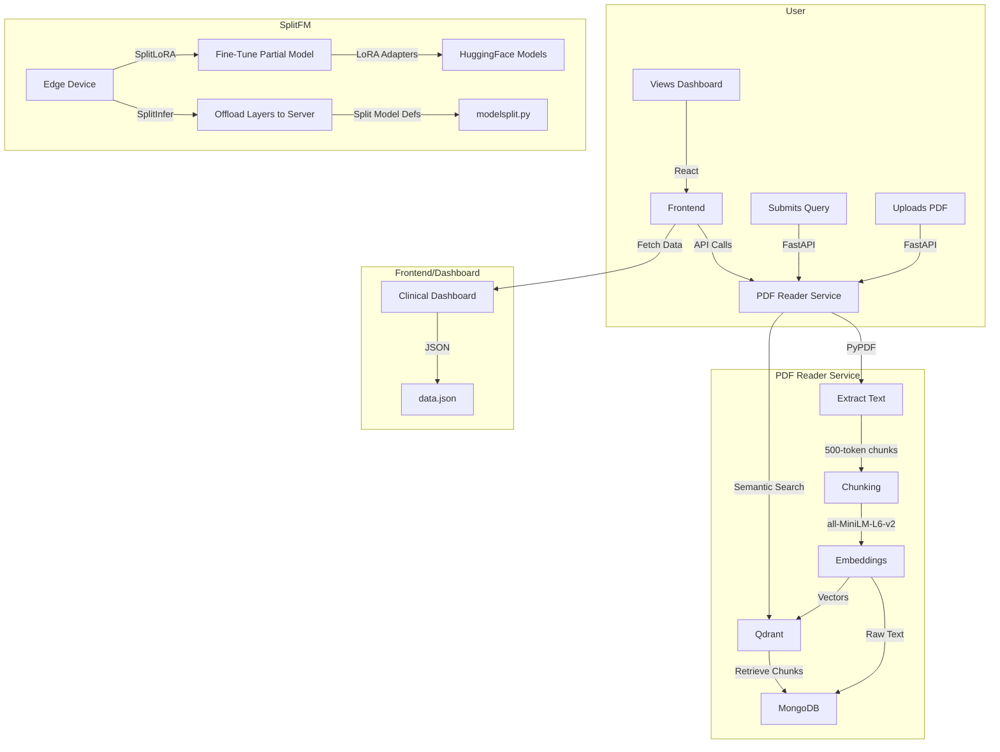

# Master Context

This codebase is a multi-component system for **privacy-preserving, resource-efficient fine-tuning and inference of large language models (LLMs)**, combined with a **PDF semantic search service** and **clinical data dashboard**. The core is **SplitFM**, a framework that splits foundation models (e.g., GPT-2, Llama3) across edge/cloud boundaries using **SplitLoRA** (parameter-efficient fine-tuning) and **SplitInfer** (split inference). This enables low-memory training/inference on edge devices while offloading compute-heavy layers to a server. Alongside this, the **PDF Reader with LLM** service extracts, chunks, and embeds PDF text (using `all-MiniLM-L6-v2`) into MongoDB/Qdrant for semantic search via FastAPI. A **React frontend** (Dockerized with Nginx) provides a UI, while an **automated clinical dashboard** (early-stage) visualizes structured data. The system targets use cases like edge-device LLMs, document Q&A, and healthcare data exploration, with tradeoffs between privacy, latency, and computational efficiency.

---

# Architecture Overview

The system is split into **four major components**, each with distinct data flows and dependencies. Below are the high-level interactions, followed by detailed breakdowns.

## High-Level Data Flow


---

## Component Breakdown

### 1. **SplitFM (Core LLM Framework)**
**Location**: `SplitFM-main/`
**Purpose**: Enable split fine-tuning (`SplitLoRA`) and split inference (`SplitInfer`) for foundation models.
**Key Files**:
- **SplitLoRA**:
  - `SplitInfer/`:
    - `gpt2_ft_sfl.py`: Fine-tuning script with LoRA flags (e.g., `--lora_dim=4`).
    - `splitmodel.py`: Modified Hugging Face `transformers` to support split layers.
  - Dependencies: `loralib` (LoRA implementation), PyTorch 1.7.1+cu110.
- **SplitInfer**:
  - `infer_splitmodel.py`: Demo script for split inference.
  - `modelsplit.py`: Defines client/server model splits (e.g., `GPT2LMHeadModelClient`/`Server`).
  - `utils.py`: Helper functions for parameter loading/counting.

**Data Flow**:
1. **Fine-Tuning**:
   - Replace `nn.Linear`/`nn.Embedding` with `loralib.Linear`/`loralib.Embedding`.
   - Mark only LoRA layers as trainable (`lora.mark_only_lora_as_trainable`).
   - Save/load adapters via `lora.lora_state_dict`.
2. **Inference**:
   - Split model into client (edge) and server (cloud) portions.
   - Offload hidden layers to server; keep input/output on edge.
   - Use `modelsplit.py` to define split points (e.g., after `n` transformer blocks).

---

### 2. **PDF Reader with LLM**
**Location**: `PDF Reader/`
**Purpose**: Semantic search over PDF documents using embeddings.
**Key Files**:
- **FastAPI Service** (`app/main.py`):
  - `/upload-pdf`: Accepts PDFs, extracts text via `PyPDF`, chunks it (500 tokens, 50-token overlap), and indexes into MongoDB/Qdrant.
  - `/query`: Accepts a `QueryRequest` (Pydantic model), returns top-`k` semantic matches.
- **Embedding Pipeline**:
  - `embeddings.py`: Loads `all-MiniLM-L6-v2` (384-dim vectors).
  - `chunker.py`: Splits text into overlapping chunks.
  - `pdf_loader.py`: Extracts text per page using `PyPDF`.
- **Database**:
  - `mongodb.py`: Stores raw chunks in `pdf_db.chunks` collection.
  - `qdrant.py`: Stores embeddings in `pdf_chunks` collection (Cosine similarity).

**Data Flow**:
1. PDF upload → `extract_pdf_text` → `chunk_text` → `get_embedding` → `index_chunks` (MongoDB + Qdrant).
2. Query → `get_embedding` → Qdrant search → Retrieve chunks from MongoDB → Return results.

---

### 3. **Frontend**
**Location**: `frontend/`
**Purpose**: React-based UI for interacting with the PDF Reader and dashboards.
**Key Files**:
- `Dockerfile`: Multi-stage build (Node 20 → Nginx 1.25).
- `src/`: React components (auto-generated minified files in diff, e.g., `react.production.min.js`).
- `nginx.conf`: Serves static files on port 80.

**Data Flow**:
- User → React UI → FastAPI endpoints (`/upload-pdf`, `/query`) → Display results.

---

### 4. **Clinical Dashboard (Early-Stage)**
**Location**: `dashboard_auto/`
**Purpose**: Automated visualization of clinical data.
**Key Files**:
- `clinical_dashboard.html`: Static HTML skeleton.
- `data.json`: Sample data (`{"data": [1, 2, 3, 4, 5]}`).
- `prepare_dashboard.bat`: Calls `prepare_dashboard.py` (not yet committed).

**Data Flow**:
- `prepare_dashboard.py` (future) → `data.json` → `clinical_dashboard.html`.

---

# Key Decision Log

1. **SplitLoRA for Parameter-Efficient Fine-Tuning**
   - **Decision**: Replace `nn.Linear`/`nn.Embedding` with `loralib.Linear`/`loralib.Embedding` and use `lora.mark_only_lora_as_trainable`.
   - **Rationale**: Reduces memory usage by freezing pre-trained weights and only training low-rank adapters (LoRA). Enables fine-tuning on edge devices with limited GPU memory.
   - **Tradeoff**: Requires modifying model definitions to use `loralib` layers.

2. **SplitInfer for Edge-Cloud Model Partitioning**
   - **Decision**: Split models into client (edge) and server (cloud) portions using `modelsplit.py`.
   - **Rationale**: Offloads compute-heavy layers (e.g., middle transformer blocks) to the cloud while keeping input/output on-edge for privacy.
   - **Tradeoff**: Introduces network latency between edge and cloud layers.

3. **FastAPI + MongoDB/Qdrant for PDF Semantic Search**
   - **Decision**: Use FastAPI for the PDF service, MongoDB for raw text storage, and Qdrant for vector search.
   - **Rationale**:
     - FastAPI: Lightweight, async, and easy to Dockerize.
     - MongoDB: Flexible schema for storing chunks with metadata (e.g., page numbers).
     - Qdrant: Optimized for cosine similarity search over embeddings.
   - **Tradeoff**: Requires managing two databases (MongoDB for text, Qdrant for vectors).

4. **React + Nginx for Frontend**
   - **Decision**: Dockerized React app served via Nginx.
   - **Rationale**: Standardized production setup with multi-stage builds (smaller final image) and Nginx for static file serving.
   - **Tradeoff**: Adds Node.js build dependency to the stack.

5. **Python Version Pinning**
   - **Decision**: SplitLoRA uses Python 3.7.16 + PyTorch 1.7.1; SplitInfer uses Python 3.8.20 + PyTorch 2.4.1.
   - **Rationale not documented**.

---

# Gotchas & Tech Debt

### PDF Reader Service
1. **Docker CPU-Only Limitation** (Checkpoint-Saarthak_Khandelwal):
   - The Dockerfile installs CPU-only PyTorch (`torch==2.2.2+cpu`), which will slow down embedding generation (`all-MiniLM-L6-v2`). No GPU support is configured.
   - **Impact**: High latency for embedding large PDFs.

2. **Hardcoded Chunking Parameters** (Checkpoint-Saarthak_Khandelwal):
   - `chunk_text` uses fixed values (`size=500`, `overlap=50`). No way to configure these via API or env vars.
   - **Impact**: Poor performance for documents with very long/short sentences.

3. **Missing Error Handling** (Checkpoint-Saarthak_Khandelwal):
   - No validation for:
     - Corrupt PDFs (e.g., `PyPDF` errors).
     - MongoDB/Qdrant connection failures.
     - Empty queries or non-PDF uploads.
   - **Impact**: API will crash on invalid inputs.

4. **`.DS_Store` Files in Version Control** (Checkpoint-Zwarup):
   - macOS metadata files (`/.DS_Store`, `/frontend/.DS_Store`, etc.) are committed.
   - **Impact**: Bloats repo size; irrelevant files in production.

### SplitFM
5. **PyTorch Version Conflict** (Checkpoint-Exalt_07):
   - SplitLoRA requires PyTorch 1.7.1+cu110; SplitInfer requires 2.4.1.
   - **Impact**: Cannot use both components in the same environment without conflicts.

6. **Undocumented Split Points** (Checkpoint-Exalt_07):
   - `modelsplit.py` defines client/server splits (e.g., `GPT2LMHeadModelClient`), but no guidance on how to choose split layers for custom models.
   - **Impact**: Users may split models suboptimally, hurting performance/privacy.

7. **Missing Submodule** (Checkpoint-Zwarup):
   - Commit `05d4e7b` removed a submodule at `5da7a2ecce4e20501f53adf5797ac70a2be3a0f4` without replacement.
   - **Impact**: Builds depending on this submodule will fail.

### Frontend
8. **Uncommitted `prepare_dashboard.py`** (Checkpoint-Gagan_N_Bangaragiri):
   - `prepare_dashboard.bat` calls a missing `prepare_dashboard.py`.
   - **Impact**: Dashboard automation is non-functional.

9. **No CORS Configuration** (Checkpoint-Karan_Bihani):
   - The React frontend will need CORS headers to call FastAPI endpoints.
   - **Impact**: Frontend API requests will fail unless FastAPI adds CORS middleware.

---

# Dependency Map

| Dependency               | Version          | Role                                                                 | Component(s) Using It          |
|--------------------------|------------------|----------------------------------------------------------------------|---------------------------------|
| **Python**               | 3.7.16 / 3.8.20  | Runtime for SplitFM and PDF Reader.                                | SplitLoRA / SplitInfer         |
| PyTorch                  | 1.7.1+cu110 / 2.4.1 | Deep learning framework. SplitLoRA and SplitInfer use different versions. | SplitFM                         |
| loralib                  | (from source)    | Low-rank adaptation (LoRA) for fine-tuning.                        | SplitLoRA                       |
| Hugging Face `transformers` | (not pinned)    | Pre-trained model definitions (GPT-2, Llama3, etc.).              | SplitFM                         |
| FastAPI                  | (not pinned)     | Web framework for PDF Reader service.                              | PDF Reader                      |
| Uvicorn                  | (not pinned)     | ASGI server for FastAPI.                                            | PDF Reader                      |
| PyPDF                    | (not pinned)     | PDF text extraction.                                                | PDF Reader (`pdf_loader.py`)    |
| sentence-transformers    | (not pinned)     | `all-MiniLM-L6-v2` embeddings.                                      | PDF Reader (`embeddings.py`)    |
| Qdrant                   | (Docker image)   | Vector database for semantic search.                                | PDF Reader                      |
| MongoDB                  | 6.0              | Document store for PDF chunks.                                      | PDF Reader                      |
| React                    | 18.3.1           | Frontend UI framework.                                              | Frontend                        |
| Nginx                    | 1.25-alpine      | Web server for static files.                                        | Frontend                        |
| Node.js                  | 20-alpine        | Build environment for React.                                       | Frontend (Dockerfile)           |
| D3.js/Chart.js           | (not committed)  | Likely future dashboard visualizations.                             | Clinical Dashboard              |

---

# Getting Started

### Prerequisites
1. Install [Docker](https://docs.docker.com/get-docker/) and [docker-compose](https://docs.docker.com/compose/install/).
2. [Verify] Install Python 3.7.16 **and** 3.8.20 (for SplitLoRA/SplitInfer compatibility).
3. Install Node.js 20+ (for frontend).

---

### Step 1: Run the PDF Reader Service
1. Navigate to `PDF Reader/`:
   ```bash
   cd PDF\ Reader/
   ```
2. Build and start the services:
   ```bash
   docker-compose up --build
   ```
   - This launches:
     - FastAPI on `http://localhost:8000`
     - MongoDB on `localhost:27017`
     - Qdrant on `localhost:6333`
3. Test the API:
   - Upload a PDF:
     ```bash
     curl -X POST -F "file=@Grandma's Bag of Stories - Grandma's Bag of Stories by Sudha Murthy.pdf" http://localhost:8000/upload-pdf
     ```
   - Query the PDF:
     ```bash
     curl -X POST -H "Content-Type: application/json" -d '{"query":"What is the story about?"}' http://localhost:8000/query
     ```

---

### Step 2: Set Up SplitFM
1. Navigate to `SplitFM-main/`:
   ```bash
   cd ../SplitFM-main/
   ```
2. Install dependencies for SplitLoRA:
   ```bash
   pip install torch==1.7.1+cu110 -f https://download.pytorch.org/whl/torch_stable.html
   pip install loralib
   ```
3. Fine-tune a model (example for GPT-2):
   ```bash
   python SplitInfer/gpt2_ft_sfl.py \
     --train_data0=data/train0.json \
     --train_data1=data/train1.json \
     --lora_dim=4 \
     --train_batch_size=8
   ```
4. [Verify] For SplitInfer, create a Python 3.8.20 environment and install:
   ```bash
   pip install torch==2.4.1
   pip install -r requirements.txt  # (if exists)
   ```
5. Run split inference:
   ```bash
   python infer_splitmodel.py --model_name gpt2-medium
   ```

---

### Step 3: Launch the Frontend
1. Navigate to `frontend/`:
   ```bash
   cd ../frontend/
   ```
2. Install dependencies:
   ```bash
   npm install
   ```
3. Build the app:
   ```bash
   npm run build
   ```
4. Start the Docker container:
   ```bash
   docker build -t frontend .
   docker run -p 80:80 frontend
   ```
   - Access the UI at `http://localhost`.

---

### Step 4: [Verify] Clinical Dashboard
1. Navigate to `dashboard_auto/`:
   ```bash
   cd ../dashboard_auto/
   ```
2. [Verify] Run the data preparation script (once committed):
   ```bash
   python prepare_dashboard.py
   ```
3. Open `clinical_dashboard.html` in a browser.

---

### Debugging Tips
- **PDF Reader Issues**:
  - If Qdrant/MongoDB fail to start, check ports `6333`/`27017` are free.
  - For embedding errors, ensure `sentence-transformers` is installed in the Docker container.
- **SplitFM Issues**:
  - PyTorch version conflicts? Use separate virtual environments for SplitLoRA (1.7.1) and SplitInfer (2.4.1).
  - LoRA not applying? Verify `lora.mark_only_lora_as_trainable(model)` is called before training.
- **Frontend Issues**:
  - Blank screen? Check the Nginx logs in the Docker container:
    ```bash
    docker logs <container_id>
    ```
  - CORS errors? Add FastAPI CORS middleware in `app/main.py`:
    ```python
    from fastapi.middleware.cors import CORSMiddleware
    app.add_middleware(CORSMiddleware, allow_origins=["*"])
    ```