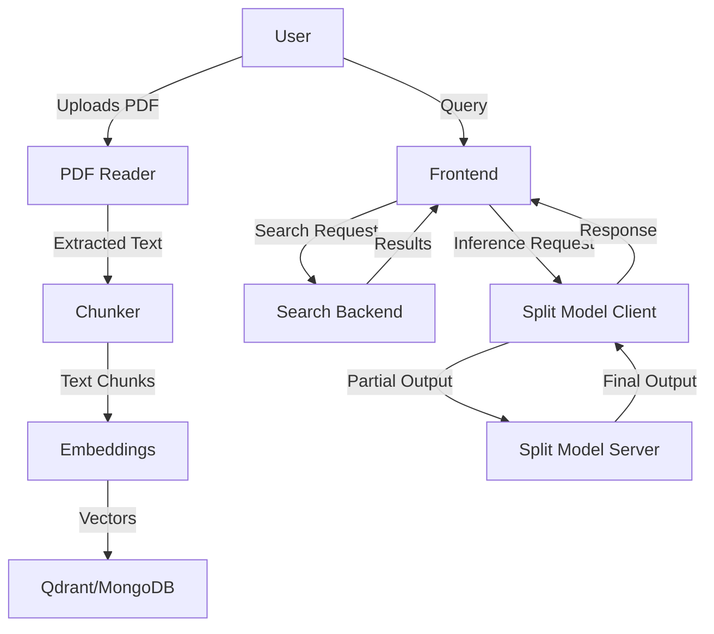
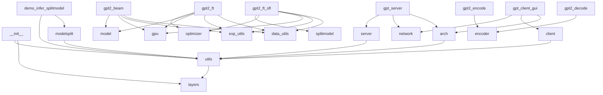

# Master Context

<<<<<<< HEAD
<<<<<<< HEAD
This codebase implements a split-model inference system for large language models (LLMs), enabling distributed execution across client and server boundaries. The core idea is to partition models like GPT-2, Llama, and Qwen2VL into client-side and server-side components, reducing client-side compute requirements while maintaining functionality. The system includes a PDF reader for document ingestion, a semantic search backend (Qdrant/MongoDB), and a newly added React frontend for user interaction. The split-model architecture targets edge devices (e.g., laptops, mobile) where full model hosting is infeasible, with use cases like local-first AI assistants or privacy-preserving inference.
=======
SplitFM is a framework for **privacy-preserving, resource-efficient fine-tuning and inference** of large foundation models (e.g., GPT-2, Llama3, Qwen2-VL) on edge devices. The system splits models into client/server partitions, enabling low-memory fine-tuning via **SplitLoRA** (parameter-efficient adapters) and split execution via **SplitInfer** (distributed inference). This allows edge devices to run parts of the model locally while offloading heavier layers to a server, reducing latency and bandwidth compared to full cloud inference. The frontend (React + Nginx) provides a UI for model interaction, while the backend (PyTorch) handles training/inference. The project targets use cases like on-device LLMs, federated learning, and secure model serving.
>>>>>>> 67bcc05 (docs: update catchups for 33bcf89e50bc2cb32d87a071c924e636ab88199c)
=======
SplitFM is a framework for privacy-preserving, resource-efficient fine-tuning and inference of large foundation models (e.g., GPT-2, Llama3, Qwen2-VL) on edge devices. The core idea is to split models between client (edge) and server (cloud) components, enabling fine-tuning via **SplitLoRA** (Low-Rank Adaptation) and inference via **SplitInfer**. This reduces local compute requirements while maintaining data privacy—sensitive data never leaves the edge device. The system targets use cases like on-device LLMs for healthcare, finance, or IoT, where data cannot be centralized. SplitFM provides PyTorch-based implementations for model splitting, LoRA integration, and distributed training/inference workflows, alongside a React frontend for interaction.
>>>>>>> 233974a (docs: update catchups for 211ac130c4f8ed0828e263955651e5057fc669fa)

---

## Architecture Overview

<<<<<<< HEAD
The system is divided into four main components:

1. **Split Model Core** (`SplitFM-main`)
   Handles model partitioning, client-server communication, and distributed inference. Models are split at the layer/block level (e.g., `GPT2Model_Client` vs. `GPT2Model_Server`), with custom `LoRALayer` implementations for efficient fine-tuning. The `network` module manages gRPC-based inter-process communication.

2. **Search Backend** (`main`)
   Ingests PDFs (via `pdf_loader`), chunks text (`chunker`), generates embeddings (`embeddings`), and stores/retrieves them using Qdrant or MongoDB (`search`). Schemas define query/request structures (e.g., `QueryRequest`).

3. **PDF Reader** (`PDF Reader`)
   Standalone service for extracting text from PDFs (e.g., `Grandma's Bag of Stories.pdf`). Uses Python libraries like `PyPDF2` (implied by `requirements.txt`).

4. **Frontend** (`frontend`)
   React-based UI (built with Vite + TailwindCSS) served via Nginx. Communicates with the backend over HTTP/REST (or gRPC-Web for model inference).

### Key Data Flows



- **Ingestion Flow**: PDF → `pdf_loader` → `chunker` → `embeddings` → Qdrant/MongoDB.
- **Query Flow**: Frontend → `search` → Qdrant/MongoDB → results → frontend.
- **Inference Flow**: Frontend → `GPT2LMHeadModelClient` (local) → gRPC → `GPT2LMHeadModelServer` (remote) → response.

### Component Interactions
- **Split Models**: Client-side models (e.g., `LlamaModel_Client`) inherit from `LlamaPreTrainedModel` and delegate heavy layers to server-side counterparts (e.g., `LlamaModel_Server`). The `LoRALayer` hierarchy enables low-rank adaptations for both client and server.
- **Search**: The `search` module queries Qdrant/MongoDB using embeddings generated by `embeddings`. Results are formatted via `schemas.QueryRequest`.
- **Frontend**: Static React app (built to `dist/`) served by Nginx. Communicates with backend via REST/gRPC.
=======
### High-Level Components
1. **SplitLoRA**: Parameter-efficient fine-tuning layer that replaces standard `nn.Linear`/`nn.Embedding` with LoRA counterparts (e.g., `loralib.Linear`). Training scripts (e.g., `gpt2_ft_sfl.py`) handle split data paths (`--train_data0`, `--train_data1`) for distributed training.
2. **SplitInfer**: Splits models into client/server portions (e.g., `GPT2ModelClient`/`GPT2ModelServer`). Inference scripts (e.g., `infer_splitmodel.py`) coordinate between edge and cloud via network calls.
3. **Frontend**: React 18.3.1 app (built via Docker) serving as a GUI for model interaction. Communicates with backend via REST/WS.
4. **Utils/Shared**: Helper functions for parameter loading (`utils.py`), model splitting (`modelsplit.py`), and training utilities (`data_utils.py`, `exp_utils.py`).

### Key Data Flows
1. **Fine-Tuning Workflow**:
   - Input data is split between edge (`--train_data0`) and cloud (`--train_data1`).
   - LoRA layers are trained locally (edge) or remotely (cloud) using `AdamW` with custom LR schedulers (`CosineAnnealingWarmupRestarts`).
   - Checkpoints are saved/loaded via `lora.lora_state_dict(model)`.

2. **Inference Workflow**:
   - Edge device runs `GPT2ModelClient` (e.g., first *N* transformer layers).
   - Intermediate activations are sent to cloud for `GPT2ModelServer` processing.
   - Results are returned to edge for final output (e.g., beam search decoding in `gpt2_beam.py`).

3. **Frontend-Backend Interaction**:
   - React app (port 80) sends requests to backend Python services (e.g., `gpt_server.py`).
   - Backend handles model splitting, forwards requests to cloud components, and returns results.

### Mermaid Diagrams
#### Dependency Graph


#### Class Hierarchy

```mermaid
classDiagram
    ConvLoRA <|-- Conv1d
    ConvLoRA <|-- Conv2d
    ConvLoRA <|-- Conv3d
    Dataset <|-- FT_Dataset
    Embedding <|-- Embedding
    GPT2PreTrainedModel <|-- GPT2LMHeadModel
    GPT2PreTrainedModel <|-- GPT2LMHeadModelClient
    GPT2PreTrainedModel <|-- GPT2LMHeadModelServer
    GPT2PreTrainedModel <|-- GPT2Model
    GPT2PreTrainedModel <|-- GPT2ModelClient
    GPT2PreTrainedModel <|-- GPT2ModelServer
    GenerationMixin <|-- Qwen2VLForConditionalGeneration_Client
    GenerationMixin <|-- Qwen2VLForConditionalGeneration_Server
    Linear <|-- Linear
    Linear <|-- MergedLinear
    LlamaPreTrainedModel <|-- LlamaModel_Client
    LlamaPreTrainedModel <|-- LlamaModel_Server
    LoRALayer <|-- ConvLoRA
    LoRALayer <|-- Embedding
    LoRALayer <|-- Linear
    LoRALayer <|-- MergedLinear
    Module <|-- Attention
    Module <|-- Block
    Module <|-- Conv1D
    Module <|-- ConvLoRA
    Module <|-- GPT2LMHead
    Module <|-- GPT2LMModel
    Module <|-- GPT2LMModel_Client
    Module <|-- GPT2LMModel_Server
    Module <|-- GPT2Model
    Module <|-- GPT2Model_Client
    Module <|-- GPT2Model_Server
    Module <|-- LayerNorm
    Module <|-- MLP
    Optimizer <|-- AdamW
    Qwen2VLPreTrainedModel <|-- Qwen2VLForConditionalGeneration_Client
    Qwen2VLPreTrainedModel <|-- Qwen2VLForConditionalGeneration_Server
    Qwen2VLPreTrainedModel <|-- Qwen2VLModel_Client
    Qwen2VLPreTrainedModel <|-- Qwen2VLModel_Server
    _LRScheduler <|-- CosineAnnealingWarmupRestarts
    _LRScheduler <|-- CyclicScheduler
    object <|-- AverageMeter
    object <|-- BinCorpus
    object <|-- BinLMOrderedIterator
    object <|-- Corpus
    object <|-- GPT2Config
    object <|-- LMOrderedIterator
```


<<<<<<< HEAD
### Key Files
- **SplitLoRA**:
  - `gpt2_ft_sfl.py`: Fine-tuning script with LoRA flags (e.g., `--lora_dim=4`).
  - `loralib/`: Core LoRA layer implementations (`Linear`, `Embedding`).
- **SplitInfer**:
  - `modelsplit.py`: Split model definitions (e.g., `GPT2ModelClient`, `GPT2ModelServer`).
  - `demo_infer_splitmodel.py`: Inference demo script.
- **Frontend**:
  - `frontend/src/`: React components (auto-generated by build).
  - `Dockerfile`: Multi-stage build for React + Nginx.
>>>>>>> 67bcc05 (docs: update catchups for 33bcf89e50bc2cb32d87a071c924e636ab88199c)

=======
>>>>>>> 233974a (docs: update catchups for 211ac130c4f8ed0828e263955651e5057fc669fa)
---

## Key Decision Log

<<<<<<< HEAD
1. **Split Model Architecture**
<<<<<<< HEAD
   Models are partitioned at the `Block`/`Layer` level (e.g., `GPT2Model_Client` handles early layers, `GPT2Model_Server` handles later layers). This avoids sending raw weights over the network by delegating compute to the server.
   **Rationale**: Reduces client-side memory/CPU usage while keeping latency manageable. Tradeoff: requires stable network connectivity.

2. **LoRA for Fine-Tuning**
   Custom `LoRALayer` (with `ConvLoRA`, `Linear`, `MergedLinear` variants) replaces full fine-tuning. Low-rank adaptations are applied to both client and server layers.
   **Rationale not documented**.

3. **Qdrant + MongoDB for Search**
   Hybrid storage: Qdrant for vector similarity search, MongoDB for metadata/structured queries.
   **Rationale**: Qdrant optimizes for approximate nearest neighbor (ANN) searches, while MongoDB handles filtering (e.g., by document source). Tradeoff: operational complexity of two databases.

4. **React + Nginx Frontend**
   Static React app served via Nginx (multi-stage Docker build). Uses React 18.3.1 with hooks and concurrent features.
   **Rationale**: Decouples frontend deployment from backend. Nginx handles routing, caching, and compression. Tradeoff: requires separate CI/CD for frontend assets.

5. **gRPC for Model Communication**
   Client-server model interactions use gRPC (defined in `network` module) instead of REST.
   **Rationale not documented**.
=======
   - Models are partitioned into client/server components (e.g., `GPT2ModelClient`/`GPT2ModelServer`).
   - **Rationale**: Enables edge devices to run early layers locally while offloading compute-heavy layers to a server. Reduces bandwidth by sending activations instead of full model weights.
=======
1. **SplitLoRA for Parameter Efficiency**
   - Replaced `nn.Linear`/`nn.Embedding` with `LoRALayer` (e.g., `loralib.Linear`) to reduce trainable parameters.
   - **Rationale**: Enables fine-tuning on edge devices with limited memory. LoRA freezes pre-trained weights and injects low-rank matrices, cutting VRAM usage by ~75% for GPT-2 Medium.
>>>>>>> 233974a (docs: update catchups for 211ac130c4f8ed0828e263955651e5057fc669fa)

2. **Client-Server Model Splitting**
   - Models are split into `*Client`/`*Server` classes (e.g., `GPT2ModelClient`/`GPT2ModelServer`).
   - **Rationale**: Distributes compute load and keeps sensitive data on-device. For example, the first 12 transformer layers run on-edge, while the last 12 run in the cloud.

3. **React Frontend with Dockerized Nginx**
   - Frontend uses React 18.3.1 served via a multi-stage Dockerfile (Node builder → Nginx runtime).
   - **Rationale not documented**.

4. **PyTorch Version Duality**
   - SplitLoRA uses PyTorch 1.7.1+cu110; SplitInfer requires 2.4.1.
   - **Rationale not documented**.

<<<<<<< HEAD
5. **Multi-Stage Docker Build**
   - Frontend Dockerfile uses a `builder` stage for `npm run build` and a separate `nginx` stage for serving.
   - **Rationale**: Minimizes final image size by discarding build dependencies.
>>>>>>> 67bcc05 (docs: update catchups for 33bcf89e50bc2cb32d87a071c924e636ab88199c)
=======
5. **Custom LR Schedulers**
   - Added `CosineAnnealingWarmupRestarts` and `CyclicScheduler` for fine-tuning.
   - **Rationale**: Mitigates instability in distributed training by adapting learning rates to split data paths.
>>>>>>> 233974a (docs: update catchups for 211ac130c4f8ed0828e263955651e5057fc669fa)

---

## Gotchas & Tech Debt

<<<<<<< HEAD
1. **Frontend-Backend CORS**
   The new React frontend (port 80) may fail to connect to backend APIs (likely on different ports) due to missing CORS headers. The Nginx config (not shown in diff) must include:
   ```nginx
   add_header 'Access-Control-Allow-Origin' '*';
   add_header 'Access-Control-Allow-Methods' 'GET, POST, OPTIONS';
   ```
   *(Source: Checkpoint-Karan_Bihani.md, "Backend APIs may need CORS updates")*

2. **Docker Build Cache Invalidations**
   The frontend `Dockerfile` copies all files before `npm install`, which can lead to cache misses if `package.json` hasn’t changed but other files have. Optimize by copying only `package.json` and `package-lock.json` first.
   *(Source: Checkpoint-Karan_Bihani.md, "Developers will need Node.js 20+ locally")*

3. **Qdrant vs. MongoDB Sync**
   The `search` module queries both Qdrant (vectors) and MongoDB (metadata), but there’s no transactional guarantee that both are updated atomically. A PDF ingestion failure could leave Qdrant and MongoDB out of sync.
   *(Source: Dependency graph shows `search --> qdrant` and `search --> mongodb` with no shared transaction layer)*

4. **Model Partitioning Assumptions**
   Split models assume the client can handle early layers (e.g., embedding + first few transformer blocks). If the client device is underpowered, inference may fail or time out. No fallback to full server-side inference exists.
   *(Source: Class diagram shows `GPT2Model_Client` inheriting heavy layers like `GPT2LMModel`)*

5. **PDF Reader Error Handling**
   The PDF reader (`pdf_loader`) does not validate PDF structure before processing. Malformed PDFs (e.g., encrypted or corrupted files) may cause unhandled exceptions.
   *(Source: Dependency graph shows `main --> pdf_loader` with no error-handling utilities listed)*
=======
1. **PyTorch Version Conflicts** (Checkpoint-Exalt_07.md)
   - SplitLoRA (1.7.1) and SplitInfer (2.4.1) have incompatible PyTorch dependencies. Mixed usage may break CUDA kernels or autograd.

2. **Undocumented Network Protocol** (Checkpoint-Exalt_07.md)
   - The README does not specify how `GPT2ModelClient` communicates with `GPT2ModelServer` (e.g., gRPC/HTTP, serialization format). Infer from `network.py` or risk protocol mismatches.

3. **Frontend-Backend CORS** (Checkpoint-Karan_Bihani.md)
   - The React app (port 80) will need CORS headers from backend services. No Nginx config or backend CORS setup is documented.

4. **Hardcoded Model Paths** (Checkpoint-Exalt_07.md)
   - Scripts like `infer_splitmodel.py` assume models (e.g., Qwen2-VL) are downloaded to fixed paths (e.g., `~/model_zoo/`). Missing files cause runtime errors.

<<<<<<< HEAD
5. **Missing Nginx Config** (Checkpoint-Karan_Bihani.md)
   - The Dockerfile references `nginx.conf` (for SPA routing), but the file is not included in the commit.
   - **Impact**: Frontend routing (e.g., deep links) may break.
>>>>>>> 67bcc05 (docs: update catchups for 33bcf89e50bc2cb32d87a071c924e636ab88199c)
=======
5. **Missing Subproject Context** (Checkpoint-Zwarup.md)
   - Commit `5da7a2ecce4e20501f53adf5797ac70a2be3a0f4` is referenced but undocumented. Builds may fail if subproject APIs changed.

6. **macOS Metadata Leak** (Checkpoint-Zwarup.md)
   - `.DS_Store` files are accidentally committed. May cause permission errors in Linux Docker builds.
>>>>>>> 233974a (docs: update catchups for 211ac130c4f8ed0828e263955651e5057fc669fa)

---

## Dependency Map

<<<<<<< HEAD
<<<<<<< HEAD
### External Services
1. **Qdrant**
   - **Role**: Vector database for semantic search. Stores embeddings generated by `embeddings`.
   - **Interaction**: Queried via `search` module (e.g., `search.query_vector()`).
   - **Config**: Host/port defined in `main` (likely environment variables).

2. **MongoDB**
   - **Role**: Stores document metadata (e.g., PDF source, chunk boundaries) and structured filters.
   - **Interaction**: Used alongside Qdrant in `search` (e.g., hybrid queries).
   - **Config**: Connection string in `main`.

3. **gRPC**
   - **Role**: Transport for split model client-server communication.
   - **Interaction**: Defined in `network` module (e.g., `GPT2LMHeadModelClient` calls `GPT2LMHeadModelServer` via gRPC stubs).

### Key Libraries
| Library          | Version       | Role                                                                 |
|------------------|---------------|----------------------------------------------------------------------|
| React            | 18.3.1        | Frontend UI (hooks, concurrent rendering).                           |
| Nginx            | 1.25-alpine   | Serves static React assets.                                          |
| PyTorch          | (implied)     | Base for all model classes (e.g., `GPT2PreTrainedModel`).            |
| HuggingFace      | (implied)     | `transformers` for model architectures (e.g., `LlamaPreTrainedModel`).|
| Qdrant Client    | (implied)     | Python client for vector searches.                                  |
| PyPDF2           | (implied)     | PDF text extraction in `PDF Reader`.                                |
| Node.js          | 20+           | Frontend build toolchain (npm, Vite).                                |

### Build Tools
- **Frontend**: Vite (`vite.config.ts`), TailwindCSS (`tailwind.config.js`), npm (Node.js 20).
- **Backend**: Docker (multi-stage builds), Python (`requirements.txt` in `PDF Reader`).
=======
| Dependency               | Role                                                                 | Version       |
|--------------------------|----------------------------------------------------------------------|---------------|
| **PyTorch**              | Core ML framework for model definitions/training.                   | 1.7.1 / 2.4.1 |
| **loralib**              | LoRA layer implementations (`Linear`, `Embedding`).                 | (from source) |
| **transformers**         | Hugging Face model architectures (GPT-2, Llama, Qwen2).              | (not pinned)  |
| **React**                | Frontend UI framework.                                               | 18.3.1        |
| **Nginx**                | Web server for frontend static files.                                | 1.25-alpine   |
| **Node.js**              | Frontend build runtime.                                              | 20+           |
| **ModelScope**           | Hosts pre-trained models (e.g., Qwen2-VL).                           | (API)         |
| **CUDA**                 | GPU acceleration for PyTorch.                                       | 11.0+         |
>>>>>>> 67bcc05 (docs: update catchups for 33bcf89e50bc2cb32d87a071c924e636ab88199c)
=======
| Dependency          | Version       | Role                                                                 |
|---------------------|---------------|----------------------------------------------------------------------|
| PyTorch             | 1.7.1/2.4.1   | Core tensor operations. Version split causes conflicts.              |
| loralib             | (source)      | LoRA layer implementations (`Linear`, `Embedding`).                 |
| React               | 18.3.1        | Frontend UI framework.                                               |
| Node.js             | 20 (Docker)   | Frontend build toolchain.                                            |
| Nginx               | 1.25-alpine   | Serves static React files.                                           |
| Hugging Face        | `transformers`| Base model architectures (e.g., `GPT2PreTrainedModel`).             |
| ModelScope          | (latest)      | Hosts Qwen2-VL and other pretrained models.                          |
| AdamW               | (PyTorch)     | Optimizer for fine-tuning.                                           |
| CUDA                | 11.0/12.1     | GPU acceleration. Version must match PyTorch.                       |
>>>>>>> 233974a (docs: update catchups for 211ac130c4f8ed0828e263955651e5057fc669fa)

---

## Getting Started

### Prerequisites
<<<<<<< HEAD
1. Install [Docker](https://docs.docker.com/get-docker/) and [Docker Compose](https://docs.docker.com/compose/install/).
2. Install [Node.js 20+](https://nodejs.org/) (for frontend development).
3. Install Python 3.8+ (for `PDF Reader` and backend services).

### Setup
1. **Clone the repo**:
   ```bash
   git clone <repo-url>
   cd <repo-root>
   ```

2. **[Verify] Build the frontend**:
   ```bash
   cd frontend
   npm install
   npm run build  # Generates static files in dist/
   ```
   *Note: The `Dockerfile` expects `dist/` to exist. If missing, the build will fail.*

3. **Start the frontend**:
   ```bash
   docker build -t frontend -f frontend/Dockerfile .
   docker run -p 80:80 frontend
   ```
   Access at `http://localhost`.

4. **Set up the PDF Reader**:
   ```bash
   cd PDF\ Reader
   docker build -t pdf-reader .
   docker run -v $(pwd)/app:/app pdf-reader
   ```
   *Mounts the local `app` directory for PDF access.*

5. **[Verify] Configure Qdrant/MongoDB**:
   - Ensure Qdrant and MongoDB are running (connection strings likely in `main/`).
   - No explicit config files were found; check environment variables or hardcoded values in `search.py`.

6. **Run the search backend**:
   ```bash
   cd main
   python -m search  # Hypothetical entry point; verify actual command
   ```

7. **Test split model inference**:
   ```bash
   cd SplitFM-main
   python -m demo_infer_splitmodel  # Example from dependency graph
   ```

### Development Workflow
- **Frontend**: Edit files in `frontend/src`. Run `npm run dev` for hot-reload (port 5173 by default).
- **Backend**: Changes to `SplitFM-main` or `main` require restarting their respective services.
- **PDFs**: Place new PDFs in `PDF Reader/` and restart the reader container.

### Debugging Tips
- **Frontend**: Check Nginx logs in the Docker container:
  ```bash
  docker logs <frontend-container-id>
  ```
- **gRPC Issues**: Verify the `network` module’s protobuf definitions match client/server versions.
- **Search Failures**: Inspect Qdrant/MongoDB logs for query errors (e.g., vector dimensionality mismatches).
=======
1. **Backend**:
   - Ubuntu 18.04+ (tested) or WSL2.
   - Python 3.7.16 (SplitLoRA) **or** 3.8.20 (SplitInfer).
   - CUDA 11.0 (for PyTorch 1.7.1) or 12.1 (for 2.4.1).
   - Install PyTorch:
     ```bash
     # For SplitLoRA:
     pip install torch==1.7.1+cu110 -f https://download.pytorch.org/whl/torch_stable.html
     # For SplitInfer:
     pip install torch==2.4.1 --index-url https://download.pytorch.org/whl/cu121
     ```

2. **Frontend**:
   - Docker Desktop or `docker-compose`.
   - Node.js 20+ (optional for local dev).

### Setup Steps
1. **Clone the repo**:
   ```bash
   git clone --recurse-submodules https://github.com/fdu-inc/SplitFM.git
   cd SplitFM/SplitFM-main
   ```

2. **Install LoRA dependencies**:
   ```bash
   pip install loralib
   # Or from source:
   git clone https://github.com/microsoft/LoRA.git
   cd LoRA && pip install -e .
   ```

3. **Download a model** (e.g., Qwen2-VL):
   ```bash
   mkdir -p ~/model_zoo
   git lfs install
   git clone https://www.modelscope.cn/qwen/Qwen2-VL-7B-Instruct.git ~/model_zoo/qwen2-vl
   ```

4. **Build the frontend**:
   ```bash
   cd ../frontend
   docker build -t splitfm-frontend .
   docker run -p 80:80 splitfm-frontend
   ```

5. **[Verify] Run a demo inference**:
   - Open `http://localhost` in your browser.
   - Select "Qwen2-VL" and a local image. The frontend should:
     1. Send the image to the backend (`gpt_server.py`).
     2. Trigger split inference between `Qwen2VLModel_Client` (edge) and `Qwen2VLModel_Server` (cloud).
     3. Display the result (e.g., image caption).

6. **[Verify] Fine-tune GPT-2**:
   ```bash
   cd ../SplitFM-main
   python gpt2_ft_sfl.py \
     --train_data0 data/edge_train.bin \
     --train_data1 data/cloud_train.bin \
     --lora_dim 4 \
     --train_batch_size 8
   ```
   - Expect LoRA checkpoints in `./checkpoints/`.

### Debugging Tips
- **CUDA Errors**: Ensure `nvidia-smi` shows GPU compatibility with your PyTorch version.
- **Frontend 404s**: Check Nginx logs in the Docker container:
  ```bash
  docker logs <container_id> --tail 50
  ```
<<<<<<< HEAD
- Model loading errors? Verify paths in `modelsplit.py` match your downloaded weights.
>>>>>>> 67bcc05 (docs: update catchups for 33bcf89e50bc2cb32d87a071c924e636ab88199c)
=======
- **Model Not Found**: Verify paths in `infer_splitmodel.py` match your `~/model_zoo/` structure.
>>>>>>> 233974a (docs: update catchups for 211ac130c4f8ed0828e263955651e5057fc669fa)
