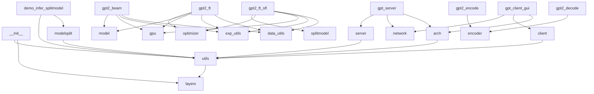

# Master Context

SplitFM is a framework for **privacy-preserving, resource-efficient fine-tuning and inference** of large foundation models (e.g., GPT-2, Llama3, Qwen2-VL) on edge devices. The system splits models into client/server partitions, enabling low-memory fine-tuning via **SplitLoRA** (parameter-efficient adapters) and split execution via **SplitInfer** (distributed inference). This allows edge devices to run parts of the model locally while offloading heavier layers to a server, reducing latency and bandwidth compared to full cloud inference. The frontend (React + Nginx) provides a UI for model interaction, while the backend (PyTorch) handles training/inference. The project targets use cases like on-device LLMs, federated learning, and secure model serving.

---

## Architecture Overview

### High-Level Components
1. **SplitLoRA**: Parameter-efficient fine-tuning via LoRA (Low-Rank Adapters) for client-side layers.
2. **SplitInfer**: Runtime for executing split models across client/server boundaries.
3. **Frontend**: React UI for model interaction, served via Nginx.
4. **Backend**: PyTorch-based model definitions, training loops, and inference scripts.

### Key Data Flows
1. **Fine-Tuning**:
   - Client-side layers (e.g., embeddings, early transformer blocks) are fine-tuned locally using LoRA.
   - Gradients/activations are synced with the server for full-model updates.
2. **Inference**:
   - Input tokens are processed on the client up to a split point.
   - Intermediate activations are sent to the server for processing by later layers.
   - Final outputs are returned to the client.

### Dependency Graph


### Class Hierarchy

```mermaid
classDiagram
    ConvLoRA <|-- Conv1d
    ConvLoRA <|-- Conv2d
    ConvLoRA <|-- Conv3d
    Dataset <|-- FT_Dataset
    Embedding <|-- Embedding
    GPT2PreTrainedModel <|-- GPT2LMHeadModel
    GPT2PreTrainedModel <|-- GPT2LMHeadModelClient
    GPT2PreTrainedModel <|-- GPT2LMHeadModelServer
    GPT2PreTrainedModel <|-- GPT2Model
    GPT2PreTrainedModel <|-- GPT2ModelClient
    GPT2PreTrainedModel <|-- GPT2ModelServer
    GenerationMixin <|-- Qwen2VLForConditionalGeneration_Client
    GenerationMixin <|-- Qwen2VLForConditionalGeneration_Server
    Linear <|-- Linear
    Linear <|-- MergedLinear
    LlamaPreTrainedModel <|-- LlamaModel_Client
    LlamaPreTrainedModel <|-- LlamaModel_Server
    LoRALayer <|-- ConvLoRA
    LoRALayer <|-- Embedding
    LoRALayer <|-- Linear
    LoRALayer <|-- MergedLinear
    Module <|-- Attention
    Module <|-- Block
    Module <|-- Conv1D
    Module <|-- ConvLoRA
    Module <|-- GPT2LMHead
    Module <|-- GPT2LMModel
    Module <|-- GPT2LMModel_Client
    Module <|-- GPT2LMModel_Server
    Module <|-- GPT2Model
    Module <|-- GPT2Model_Client
    Module <|-- GPT2Model_Server
    Module <|-- LayerNorm
    Module <|-- MLP
    Optimizer <|-- AdamW
    Qwen2VLPreTrainedModel <|-- Qwen2VLForConditionalGeneration_Client
    Qwen2VLPreTrainedModel <|-- Qwen2VLForConditionalGeneration_Server
    Qwen2VLPreTrainedModel <|-- Qwen2VLModel_Client
    Qwen2VLPreTrainedModel <|-- Qwen2VLModel_Server
    _LRScheduler <|-- CosineAnnealingWarmupRestarts
    _LRScheduler <|-- CyclicScheduler
    object <|-- AverageMeter
    object <|-- BinCorpus
    object <|-- BinLMOrderedIterator
    object <|-- Corpus
    object <|-- GPT2Config
    object <|-- LMOrderedIterator
```


### Key Files
- **SplitLoRA**:
  - `gpt2_ft_sfl.py`: Fine-tuning script with LoRA flags (e.g., `--lora_dim=4`).
  - `loralib/`: Core LoRA layer implementations (`Linear`, `Embedding`).
- **SplitInfer**:
  - `modelsplit.py`: Split model definitions (e.g., `GPT2ModelClient`, `GPT2ModelServer`).
  - `demo_infer_splitmodel.py`: Inference demo script.
- **Frontend**:
  - `frontend/src/`: React components (auto-generated by build).
  - `Dockerfile`: Multi-stage build for React + Nginx.

---

## Key Decision Log

1. **Split Model Architecture**
   - Models are partitioned into client/server components (e.g., `GPT2ModelClient`/`GPT2ModelServer`).
   - **Rationale**: Enables edge devices to run early layers locally while offloading compute-heavy layers to a server. Reduces bandwidth by sending activations instead of full model weights.

2. **LoRA for Fine-Tuning**
   - Uses Low-Rank Adapters (LoRA) for client-side fine-tuning instead of full-weight updates.
   - **Rationale**: Reduces memory/bandwidth for on-device training by freezing pre-trained weights and only updating small adapter matrices.

3. **React + Nginx Frontend**
   - Frontend is a static React app served via Nginx in a Docker container.
   - **Rationale not documented**.

4. **PyTorch Version Split**
   - SplitLoRA uses PyTorch 1.7.1, while SplitInfer requires PyTorch 2.4.1.
   - **Rationale not documented**.

5. **Multi-Stage Docker Build**
   - Frontend Dockerfile uses a `builder` stage for `npm run build` and a separate `nginx` stage for serving.
   - **Rationale**: Minimizes final image size by discarding build dependencies.

---

## Gotchas & Tech Debt

1. **PyTorch Version Conflicts** (Checkpoint-Exalt_07.md)
   - SplitLoRA was tested on PyTorch 1.7.1, while SplitInfer requires 2.4.1. Mixed usage may cause errors.
   - **Workaround**: Use separate virtual environments for LoRA/SplitInfer workflows.

2. **Undocumented Split Points** (Checkpoint-Exalt_07.md)
   - The README does not specify how to choose split layers (e.g., after which transformer block to partition).
   - **Impact**: Users must manually experiment with split configurations.

3. **Frontend-Backend Integration** (Checkpoint-Karan_Bihani.md)
   - The frontend commit adds a React app but does not include API endpoints or CORS configuration.
   - **Impact**: Frontend may fail to connect to backend services without additional setup.

4. **Hardcoded Model Paths** (Checkpoint-Exalt_07.md)
   - Scripts like `demo_infer_splitmodel.py` assume models are downloaded to specific paths (e.g., `~/model_weights/`).
   - **Impact**: Scripts will fail if paths are not manually created.

5. **Missing Nginx Config** (Checkpoint-Karan_Bihani.md)
   - The Dockerfile references `nginx.conf` (for SPA routing), but the file is not included in the commit.
   - **Impact**: Frontend routing (e.g., deep links) may break.

---

## Dependency Map

| Dependency               | Role                                                                 | Version       |
|--------------------------|----------------------------------------------------------------------|---------------|
| **PyTorch**              | Core ML framework for model definitions/training.                   | 1.7.1 / 2.4.1 |
| **loralib**              | LoRA layer implementations (`Linear`, `Embedding`).                 | (from source) |
| **transformers**         | Hugging Face model architectures (GPT-2, Llama, Qwen2).              | (not pinned)  |
| **React**                | Frontend UI framework.                                               | 18.3.1        |
| **Nginx**                | Web server for frontend static files.                                | 1.25-alpine   |
| **Node.js**              | Frontend build runtime.                                              | 20+           |
| **ModelScope**           | Hosts pre-trained models (e.g., Qwen2-VL).                           | (API)         |
| **CUDA**                 | GPU acceleration for PyTorch.                                       | 11.0+         |

---

## Getting Started

### Prerequisites
1. **Backend**:
   - Ubuntu 18.04+ (tested) or WSL2.
   - Python 3.7.16 (for SplitLoRA) or 3.8.20 (for SplitInfer).
   - CUDA 11.0+ and compatible GPU drivers.
   - [Verify] PyTorch: Install via `pip install torch==1.7.1+cu110` (LoRA) or `torch==2.4.1` (SplitInfer).

2. **Frontend**:
   - Docker Desktop or `docker-compose`.
   - Node.js 20+ (for local dev, optional if using Docker).

### Setup
1. **Clone the repo**:
   ```bash
   git clone <repo-url> SplitFM
   cd SplitFM
   ```

2. **Backend Setup**:
   ```bash
   # For SplitLoRA
   pip install -r requirements.txt  # [Verify] Check for a requirements.txt
   pip install loralib

   # For SplitInfer
   pip install torch==2.4.1 transformers
   ```

3. **Download Models**:
   ```bash
   mkdir -p ~/model_weights/
   # Example: Download Qwen2-VL via ModelScope (see README)
   ```

4. **Frontend Setup**:
   ```bash
   cd frontend
   npm install
   npm run build
   docker build -t splitfm-frontend .
   ```

### Run SplitInfer Demo
1. Start the server:
   ```bash
   python SplitFM-main/SplitInfer/gpt_server.py --model_path ~/model_weights/gpt2-medium
   ```
2. In another terminal, run the client:
   ```bash
   python SplitFM-main/SplitInfer/gpt_client_gui.py --server_ip 127.0.0.1
   ```
3. Open the frontend:
   ```bash
   docker run -p 80:80 splitfm-frontend
   ```
   Navigate to `http://localhost` in your browser.

### Run SplitLoRA Fine-Tuning
1. Prepare data (e.g., in `SplitFM-main/data/`).
2. Launch training:
   ```bash
   python SplitFM-main/SplitLoRA/gpt2_ft_sfl.py \
     --lora_dim 4 \
     --train_data0 data/part1.bin \
     --train_data1 data/part2.bin
   ```

### [Verify] Debugging Tips
- If PyTorch crashes, check CUDA compatibility with `nvidia-smi`.
- Frontend 404s? Ensure `nginx.conf` includes:
  ```nginx
  location / {
    try_files $uri $uri/ /index.html;
  }
  ```
- Model loading errors? Verify paths in `modelsplit.py` match your downloaded weights.