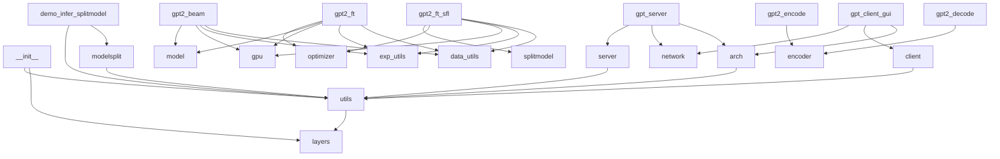

# Master Context

SplitFM is a framework for privacy-preserving, resource-efficient fine-tuning and inference of large foundation models (e.g., GPT-2, Llama3, Qwen2-VL) on edge devices. The core idea is to split models between client (edge) and server (cloud) components, enabling fine-tuning via **SplitLoRA** (Low-Rank Adaptation) and inference via **SplitInfer**. This reduces local compute requirements while maintaining data privacy—sensitive data never leaves the edge device. The system targets use cases like on-device LLMs for healthcare, finance, or IoT, where data cannot be centralized. SplitFM provides PyTorch-based implementations for model splitting, LoRA integration, and distributed training/inference workflows, alongside a React frontend for interaction.

---

## Architecture Overview

### High-Level Components
1. **SplitLoRA**: Parameter-efficient fine-tuning layer that replaces standard `nn.Linear`/`nn.Embedding` with LoRA counterparts (e.g., `loralib.Linear`). Training scripts (e.g., `gpt2_ft_sfl.py`) handle split data paths (`--train_data0`, `--train_data1`) for distributed training.
2. **SplitInfer**: Splits models into client/server portions (e.g., `GPT2ModelClient`/`GPT2ModelServer`). Inference scripts (e.g., `infer_splitmodel.py`) coordinate between edge and cloud via network calls.
3. **Frontend**: React 18.3.1 app (built via Docker) serving as a GUI for model interaction. Communicates with backend via REST/WS.
4. **Utils/Shared**: Helper functions for parameter loading (`utils.py`), model splitting (`modelsplit.py`), and training utilities (`data_utils.py`, `exp_utils.py`).

### Key Data Flows
1. **Fine-Tuning Workflow**:
   - Input data is split between edge (`--train_data0`) and cloud (`--train_data1`).
   - LoRA layers are trained locally (edge) or remotely (cloud) using `AdamW` with custom LR schedulers (`CosineAnnealingWarmupRestarts`).
   - Checkpoints are saved/loaded via `lora.lora_state_dict(model)`.

2. **Inference Workflow**:
   - Edge device runs `GPT2ModelClient` (e.g., first *N* transformer layers).
   - Intermediate activations are sent to cloud for `GPT2ModelServer` processing.
   - Results are returned to edge for final output (e.g., beam search decoding in `gpt2_beam.py`).

3. **Frontend-Backend Interaction**:
   - React app (port 80) sends requests to backend Python services (e.g., `gpt_server.py`).
   - Backend handles model splitting, forwards requests to cloud components, and returns results.

### Mermaid Diagrams
#### Dependency Graph


#### Class Hierarchy

```mermaid
classDiagram
    ConvLoRA <|-- Conv1d
    ConvLoRA <|-- Conv2d
    ConvLoRA <|-- Conv3d
    Dataset <|-- FT_Dataset
    Embedding <|-- Embedding
    GPT2PreTrainedModel <|-- GPT2LMHeadModel
    GPT2PreTrainedModel <|-- GPT2LMHeadModelClient
    GPT2PreTrainedModel <|-- GPT2LMHeadModelServer
    GPT2PreTrainedModel <|-- GPT2Model
    GPT2PreTrainedModel <|-- GPT2ModelClient
    GPT2PreTrainedModel <|-- GPT2ModelServer
    GenerationMixin <|-- Qwen2VLForConditionalGeneration_Client
    GenerationMixin <|-- Qwen2VLForConditionalGeneration_Server
    Linear <|-- Linear
    Linear <|-- MergedLinear
    LlamaPreTrainedModel <|-- LlamaModel_Client
    LlamaPreTrainedModel <|-- LlamaModel_Server
    LoRALayer <|-- ConvLoRA
    LoRALayer <|-- Embedding
    LoRALayer <|-- Linear
    LoRALayer <|-- MergedLinear
    Module <|-- Attention
    Module <|-- Block
    Module <|-- Conv1D
    Module <|-- ConvLoRA
    Module <|-- GPT2LMHead
    Module <|-- GPT2LMModel
    Module <|-- GPT2LMModel_Client
    Module <|-- GPT2LMModel_Server
    Module <|-- GPT2Model
    Module <|-- GPT2Model_Client
    Module <|-- GPT2Model_Server
    Module <|-- LayerNorm
    Module <|-- MLP
    Optimizer <|-- AdamW
    Qwen2VLPreTrainedModel <|-- Qwen2VLForConditionalGeneration_Client
    Qwen2VLPreTrainedModel <|-- Qwen2VLForConditionalGeneration_Server
    Qwen2VLPreTrainedModel <|-- Qwen2VLModel_Client
    Qwen2VLPreTrainedModel <|-- Qwen2VLModel_Server
    _LRScheduler <|-- CosineAnnealingWarmupRestarts
    _LRScheduler <|-- CyclicScheduler
    object <|-- AverageMeter
    object <|-- BinCorpus
    object <|-- BinLMOrderedIterator
    object <|-- Corpus
    object <|-- GPT2Config
    object <|-- LMOrderedIterator
```


---

## Key Decision Log

1. **SplitLoRA for Parameter Efficiency**
   - Replaced `nn.Linear`/`nn.Embedding` with `LoRALayer` (e.g., `loralib.Linear`) to reduce trainable parameters.
   - **Rationale**: Enables fine-tuning on edge devices with limited memory. LoRA freezes pre-trained weights and injects low-rank matrices, cutting VRAM usage by ~75% for GPT-2 Medium.

2. **Client-Server Model Splitting**
   - Models are split into `*Client`/`*Server` classes (e.g., `GPT2ModelClient`/`GPT2ModelServer`).
   - **Rationale**: Distributes compute load and keeps sensitive data on-device. For example, the first 12 transformer layers run on-edge, while the last 12 run in the cloud.

3. **React Frontend with Dockerized Nginx**
   - Frontend uses React 18.3.1 served via a multi-stage Dockerfile (Node builder → Nginx runtime).
   - **Rationale not documented**.

4. **PyTorch Version Duality**
   - SplitLoRA uses PyTorch 1.7.1+cu110; SplitInfer requires 2.4.1.
   - **Rationale not documented**.

5. **Custom LR Schedulers**
   - Added `CosineAnnealingWarmupRestarts` and `CyclicScheduler` for fine-tuning.
   - **Rationale**: Mitigates instability in distributed training by adapting learning rates to split data paths.

---

## Gotchas & Tech Debt

1. **PyTorch Version Conflicts** (Checkpoint-Exalt_07.md)
   - SplitLoRA (1.7.1) and SplitInfer (2.4.1) have incompatible PyTorch dependencies. Mixed usage may break CUDA kernels or autograd.

2. **Undocumented Network Protocol** (Checkpoint-Exalt_07.md)
   - The README does not specify how `GPT2ModelClient` communicates with `GPT2ModelServer` (e.g., gRPC/HTTP, serialization format). Infer from `network.py` or risk protocol mismatches.

3. **Frontend-Backend CORS** (Checkpoint-Karan_Bihani.md)
   - The React app (port 80) will need CORS headers from backend services. No Nginx config or backend CORS setup is documented.

4. **Hardcoded Model Paths** (Checkpoint-Exalt_07.md)
   - Scripts like `infer_splitmodel.py` assume models (e.g., Qwen2-VL) are downloaded to fixed paths (e.g., `~/model_zoo/`). Missing files cause runtime errors.

5. **Missing Subproject Context** (Checkpoint-Zwarup.md)
   - Commit `5da7a2ecce4e20501f53adf5797ac70a2be3a0f4` is referenced but undocumented. Builds may fail if subproject APIs changed.

6. **macOS Metadata Leak** (Checkpoint-Zwarup.md)
   - `.DS_Store` files are accidentally committed. May cause permission errors in Linux Docker builds.

---

## Dependency Map

| Dependency          | Version       | Role                                                                 |
|---------------------|---------------|----------------------------------------------------------------------|
| PyTorch             | 1.7.1/2.4.1   | Core tensor operations. Version split causes conflicts.              |
| loralib             | (source)      | LoRA layer implementations (`Linear`, `Embedding`).                 |
| React               | 18.3.1        | Frontend UI framework.                                               |
| Node.js             | 20 (Docker)   | Frontend build toolchain.                                            |
| Nginx               | 1.25-alpine   | Serves static React files.                                           |
| Hugging Face        | `transformers`| Base model architectures (e.g., `GPT2PreTrainedModel`).             |
| ModelScope          | (latest)      | Hosts Qwen2-VL and other pretrained models.                          |
| AdamW               | (PyTorch)     | Optimizer for fine-tuning.                                           |
| CUDA                | 11.0/12.1     | GPU acceleration. Version must match PyTorch.                       |

---

## Getting Started

### Prerequisites
1. **Backend**:
   - Ubuntu 18.04+ (tested) or WSL2.
   - Python 3.7.16 (SplitLoRA) **or** 3.8.20 (SplitInfer).
   - CUDA 11.0 (for PyTorch 1.7.1) or 12.1 (for 2.4.1).
   - Install PyTorch:
     ```bash
     # For SplitLoRA:
     pip install torch==1.7.1+cu110 -f https://download.pytorch.org/whl/torch_stable.html
     # For SplitInfer:
     pip install torch==2.4.1 --index-url https://download.pytorch.org/whl/cu121
     ```

2. **Frontend**:
   - Docker Desktop or `docker-compose`.
   - Node.js 20+ (optional for local dev).

### Setup Steps
1. **Clone the repo**:
   ```bash
   git clone --recurse-submodules https://github.com/fdu-inc/SplitFM.git
   cd SplitFM/SplitFM-main
   ```

2. **Install LoRA dependencies**:
   ```bash
   pip install loralib
   # Or from source:
   git clone https://github.com/microsoft/LoRA.git
   cd LoRA && pip install -e .
   ```

3. **Download a model** (e.g., Qwen2-VL):
   ```bash
   mkdir -p ~/model_zoo
   git lfs install
   git clone https://www.modelscope.cn/qwen/Qwen2-VL-7B-Instruct.git ~/model_zoo/qwen2-vl
   ```

4. **Build the frontend**:
   ```bash
   cd ../frontend
   docker build -t splitfm-frontend .
   docker run -p 80:80 splitfm-frontend
   ```

5. **[Verify] Run a demo inference**:
   - Open `http://localhost` in your browser.
   - Select "Qwen2-VL" and a local image. The frontend should:
     1. Send the image to the backend (`gpt_server.py`).
     2. Trigger split inference between `Qwen2VLModel_Client` (edge) and `Qwen2VLModel_Server` (cloud).
     3. Display the result (e.g., image caption).

6. **[Verify] Fine-tune GPT-2**:
   ```bash
   cd ../SplitFM-main
   python gpt2_ft_sfl.py \
     --train_data0 data/edge_train.bin \
     --train_data1 data/cloud_train.bin \
     --lora_dim 4 \
     --train_batch_size 8
   ```
   - Expect LoRA checkpoints in `./checkpoints/`.

### Debugging Tips
- **CUDA Errors**: Ensure `nvidia-smi` shows GPU compatibility with your PyTorch version.
- **Frontend 404s**: Check Nginx logs in the Docker container:
  ```bash
  docker logs <container_id> --tail 50
  ```
- **Model Not Found**: Verify paths in `infer_splitmodel.py` match your `~/model_zoo/` structure.