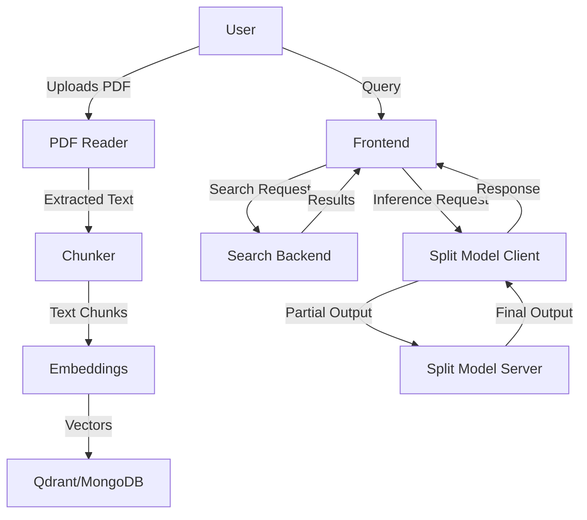

# Master Context

This codebase implements a split-model inference system for large language models (LLMs), enabling distributed execution across client and server boundaries. The core idea is to partition models like GPT-2, Llama, and Qwen2VL into client-side and server-side components, reducing client-side compute requirements while maintaining functionality. The system includes a PDF reader for document ingestion, a semantic search backend (Qdrant/MongoDB), and a newly added React frontend for user interaction. The split-model architecture targets edge devices (e.g., laptops, mobile) where full model hosting is infeasible, with use cases like local-first AI assistants or privacy-preserving inference.

---

## Architecture Overview

The system is divided into four main components:

1. **Split Model Core** (`SplitFM-main`)
   Handles model partitioning, client-server communication, and distributed inference. Models are split at the layer/block level (e.g., `GPT2Model_Client` vs. `GPT2Model_Server`), with custom `LoRALayer` implementations for efficient fine-tuning. The `network` module manages gRPC-based inter-process communication.

2. **Search Backend** (`main`)
   Ingests PDFs (via `pdf_loader`), chunks text (`chunker`), generates embeddings (`embeddings`), and stores/retrieves them using Qdrant or MongoDB (`search`). Schemas define query/request structures (e.g., `QueryRequest`).

3. **PDF Reader** (`PDF Reader`)
   Standalone service for extracting text from PDFs (e.g., `Grandma's Bag of Stories.pdf`). Uses Python libraries like `PyPDF2` (implied by `requirements.txt`).

4. **Frontend** (`frontend`)
   React-based UI (built with Vite + TailwindCSS) served via Nginx. Communicates with the backend over HTTP/REST (or gRPC-Web for model inference).

### Key Data Flows



- **Ingestion Flow**: PDF → `pdf_loader` → `chunker` → `embeddings` → Qdrant/MongoDB.
- **Query Flow**: Frontend → `search` → Qdrant/MongoDB → results → frontend.
- **Inference Flow**: Frontend → `GPT2LMHeadModelClient` (local) → gRPC → `GPT2LMHeadModelServer` (remote) → response.

### Component Interactions
- **Split Models**: Client-side models (e.g., `LlamaModel_Client`) inherit from `LlamaPreTrainedModel` and delegate heavy layers to server-side counterparts (e.g., `LlamaModel_Server`). The `LoRALayer` hierarchy enables low-rank adaptations for both client and server.
- **Search**: The `search` module queries Qdrant/MongoDB using embeddings generated by `embeddings`. Results are formatted via `schemas.QueryRequest`.
- **Frontend**: Static React app (built to `dist/`) served by Nginx. Communicates with backend via REST/gRPC.

---

## Key Decision Log

1. **Split Model Architecture**
   Models are partitioned at the `Block`/`Layer` level (e.g., `GPT2Model_Client` handles early layers, `GPT2Model_Server` handles later layers). This avoids sending raw weights over the network by delegating compute to the server.
   **Rationale**: Reduces client-side memory/CPU usage while keeping latency manageable. Tradeoff: requires stable network connectivity.

2. **LoRA for Fine-Tuning**
   Custom `LoRALayer` (with `ConvLoRA`, `Linear`, `MergedLinear` variants) replaces full fine-tuning. Low-rank adaptations are applied to both client and server layers.
   **Rationale not documented**.

3. **Qdrant + MongoDB for Search**
   Hybrid storage: Qdrant for vector similarity search, MongoDB for metadata/structured queries.
   **Rationale**: Qdrant optimizes for approximate nearest neighbor (ANN) searches, while MongoDB handles filtering (e.g., by document source). Tradeoff: operational complexity of two databases.

4. **React + Nginx Frontend**
   Static React app served via Nginx (multi-stage Docker build). Uses React 18.3.1 with hooks and concurrent features.
   **Rationale**: Decouples frontend deployment from backend. Nginx handles routing, caching, and compression. Tradeoff: requires separate CI/CD for frontend assets.

5. **gRPC for Model Communication**
   Client-server model interactions use gRPC (defined in `network` module) instead of REST.
   **Rationale not documented**.

---

## Gotchas & Tech Debt

1. **Frontend-Backend CORS**
   The new React frontend (port 80) may fail to connect to backend APIs (likely on different ports) due to missing CORS headers. The Nginx config (not shown in diff) must include:
   ```nginx
   add_header 'Access-Control-Allow-Origin' '*';
   add_header 'Access-Control-Allow-Methods' 'GET, POST, OPTIONS';
   ```
   *(Source: Checkpoint-Karan_Bihani.md, "Backend APIs may need CORS updates")*

2. **Docker Build Cache Invalidations**
   The frontend `Dockerfile` copies all files before `npm install`, which can lead to cache misses if `package.json` hasn’t changed but other files have. Optimize by copying only `package.json` and `package-lock.json` first.
   *(Source: Checkpoint-Karan_Bihani.md, "Developers will need Node.js 20+ locally")*

3. **Qdrant vs. MongoDB Sync**
   The `search` module queries both Qdrant (vectors) and MongoDB (metadata), but there’s no transactional guarantee that both are updated atomically. A PDF ingestion failure could leave Qdrant and MongoDB out of sync.
   *(Source: Dependency graph shows `search --> qdrant` and `search --> mongodb` with no shared transaction layer)*

4. **Model Partitioning Assumptions**
   Split models assume the client can handle early layers (e.g., embedding + first few transformer blocks). If the client device is underpowered, inference may fail or time out. No fallback to full server-side inference exists.
   *(Source: Class diagram shows `GPT2Model_Client` inheriting heavy layers like `GPT2LMModel`)*

5. **PDF Reader Error Handling**
   The PDF reader (`pdf_loader`) does not validate PDF structure before processing. Malformed PDFs (e.g., encrypted or corrupted files) may cause unhandled exceptions.
   *(Source: Dependency graph shows `main --> pdf_loader` with no error-handling utilities listed)*

---

## Dependency Map

### External Services
1. **Qdrant**
   - **Role**: Vector database for semantic search. Stores embeddings generated by `embeddings`.
   - **Interaction**: Queried via `search` module (e.g., `search.query_vector()`).
   - **Config**: Host/port defined in `main` (likely environment variables).

2. **MongoDB**
   - **Role**: Stores document metadata (e.g., PDF source, chunk boundaries) and structured filters.
   - **Interaction**: Used alongside Qdrant in `search` (e.g., hybrid queries).
   - **Config**: Connection string in `main`.

3. **gRPC**
   - **Role**: Transport for split model client-server communication.
   - **Interaction**: Defined in `network` module (e.g., `GPT2LMHeadModelClient` calls `GPT2LMHeadModelServer` via gRPC stubs).

### Key Libraries
| Library          | Version       | Role                                                                 |
|------------------|---------------|----------------------------------------------------------------------|
| React            | 18.3.1        | Frontend UI (hooks, concurrent rendering).                           |
| Nginx            | 1.25-alpine   | Serves static React assets.                                          |
| PyTorch          | (implied)     | Base for all model classes (e.g., `GPT2PreTrainedModel`).            |
| HuggingFace      | (implied)     | `transformers` for model architectures (e.g., `LlamaPreTrainedModel`).|
| Qdrant Client    | (implied)     | Python client for vector searches.                                  |
| PyPDF2           | (implied)     | PDF text extraction in `PDF Reader`.                                |
| Node.js          | 20+           | Frontend build toolchain (npm, Vite).                                |

### Build Tools
- **Frontend**: Vite (`vite.config.ts`), TailwindCSS (`tailwind.config.js`), npm (Node.js 20).
- **Backend**: Docker (multi-stage builds), Python (`requirements.txt` in `PDF Reader`).

---

## Getting Started

### Prerequisites
1. Install [Docker](https://docs.docker.com/get-docker/) and [Docker Compose](https://docs.docker.com/compose/install/).
2. Install [Node.js 20+](https://nodejs.org/) (for frontend development).
3. Install Python 3.8+ (for `PDF Reader` and backend services).

### Setup
1. **Clone the repo**:
   ```bash
   git clone <repo-url>
   cd <repo-root>
   ```

2. **[Verify] Build the frontend**:
   ```bash
   cd frontend
   npm install
   npm run build  # Generates static files in dist/
   ```
   *Note: The `Dockerfile` expects `dist/` to exist. If missing, the build will fail.*

3. **Start the frontend**:
   ```bash
   docker build -t frontend -f frontend/Dockerfile .
   docker run -p 80:80 frontend
   ```
   Access at `http://localhost`.

4. **Set up the PDF Reader**:
   ```bash
   cd PDF\ Reader
   docker build -t pdf-reader .
   docker run -v $(pwd)/app:/app pdf-reader
   ```
   *Mounts the local `app` directory for PDF access.*

5. **[Verify] Configure Qdrant/MongoDB**:
   - Ensure Qdrant and MongoDB are running (connection strings likely in `main/`).
   - No explicit config files were found; check environment variables or hardcoded values in `search.py`.

6. **Run the search backend**:
   ```bash
   cd main
   python -m search  # Hypothetical entry point; verify actual command
   ```

7. **Test split model inference**:
   ```bash
   cd SplitFM-main
   python -m demo_infer_splitmodel  # Example from dependency graph
   ```

### Development Workflow
- **Frontend**: Edit files in `frontend/src`. Run `npm run dev` for hot-reload (port 5173 by default).
- **Backend**: Changes to `SplitFM-main` or `main` require restarting their respective services.
- **PDFs**: Place new PDFs in `PDF Reader/` and restart the reader container.

### Debugging Tips
- **Frontend**: Check Nginx logs in the Docker container:
  ```bash
  docker logs <frontend-container-id>
  ```
- **gRPC Issues**: Verify the `network` module’s protobuf definitions match client/server versions.
- **Search Failures**: Inspect Qdrant/MongoDB logs for query errors (e.g., vector dimensionality mismatches).