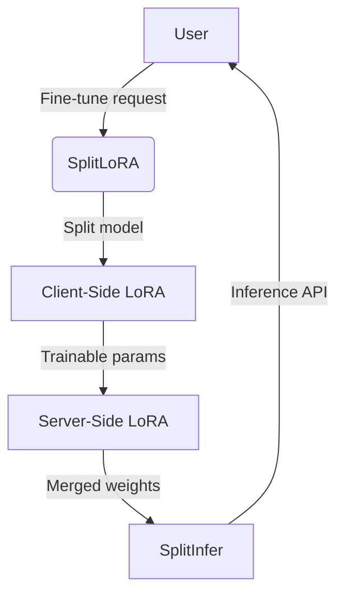
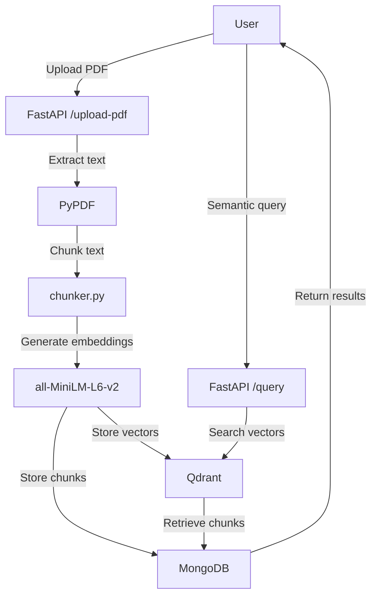
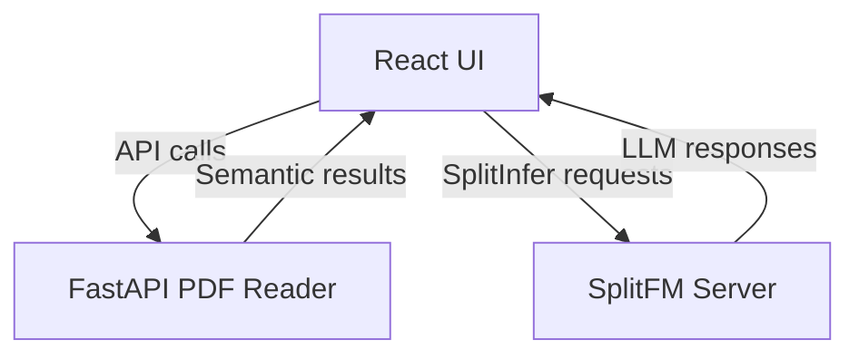

# Master Context

This codebase is a **privacy-preserving, resource-efficient AI system** for fine-tuning and deploying large language models (LLMs) on edge devices. It combines three core components: **SplitFM** (a framework for split fine-tuning and inference), a **PDF Reader with LLM** (a FastAPI service for semantic search over PDFs), and a **React frontend** for user interaction. The system enables distributed training/inference (e.g., splitting models between client and server), efficient parameter tuning via LoRA (Low-Rank Adaptation), and document Q&A via embeddings. Target use cases include edge-device LLM deployment, private document search, and lightweight fine-tuning of models like GPT-2, Llama3, and Qwen2-VL.

---

## Architecture Overview

### High-Level Components
The system is divided into four main parts:
1. **SplitFM** (`SplitFM-main/`): Core framework for split fine-tuning (`SplitLoRA`) and inference (`SplitInfer`).
2. **PDF Reader** (`PDF Reader/`): FastAPI service for PDF ingestion, chunking, embedding, and semantic search.
3. **Frontend** (`frontend/`): React UI for user interaction (likely connects to both SplitFM and PDF Reader).
4. **Shared Logic** (`src/`): React components and utilities (e.g., `App.jsx`, `components/`).

### Key Data Flows

#### 1. SplitFM Workflow

- **SplitLoRA**: Replaces `nn.Linear`/`nn.Embedding` layers with LoRA counterparts, marking only LoRA parameters as trainable. Models are split between client (edge) and server (cloud).
- **SplitInfer**: Runs inference across split models, coordinating between client/server during forward passes.

#### 2. PDF Reader Workflow

- PDFs are chunked into 500-token overlaps, embedded via `all-MiniLM-L6-v2`, and indexed in Qdrant (vectors) + MongoDB (raw text).
- Queries are embedded and matched against Qdrant’s vector index, with results hydrated from MongoDB.

#### 3. Frontend Integration


### Component Interactions
- **SplitFM** and **PDF Reader** operate independently but share a goal: efficient LLM usage. The frontend likely unifies their interfaces.
- **Dependencies**:
  - SplitFM depends on PyTorch, Hugging Face `transformers`, and `loralib`.
  - PDF Reader depends on FastAPI, Qdrant, MongoDB, and `sentence-transformers`.
  - Frontend depends on React 18 and Nginx.

---

## Key Decision Log

1. **Split Model Architecture (SplitFM)**
   - **Decision**: Split models into client/server portions during fine-tuning *and* inference.
   - **Rationale**: Enables edge-device participation in training/inference while offloading heavy layers to the cloud. Reduces client-side resource requirements (documented in `SplitFM-main/README.md`).
   - **Tradeoff**: Introduces network latency during forward/backward passes.

2. **LoRA for Parameter Efficiency**
   - **Decision**: Replace all `nn.Linear`/`nn.Embedding` layers with LoRA (Low-Rank Adaptation) variants.
   - **Rationale**: Reduces trainable parameters by 10–100x, enabling fine-tuning on consumer hardware (per `SplitFM-main/README.md` hyperparameter examples).
   - **Tradeoff**: Requires custom checkpoint handling (`lora.lora_state_dict`).

3. **PDF Chunking Strategy**
   - **Decision**: Fixed-size chunks (500 tokens) with 50-token overlaps.
   - **Rationale**: Balances semantic coherence (larger chunks) and retrieval granularity (smaller chunks). Overlap mitigates context splitting (noted in `app/services/chunker.py`).
   - **Tradeoff**: Overlaps increase storage/embedding costs by ~10%.

4. **Dual-Database Design (PDF Reader)**
   - **Decision**: Store raw chunks in MongoDB and vectors in Qdrant.
   - **Rationale**: Leverages MongoDB for flexible metadata storage and Qdrant for optimized vector search (documented in `app/database/qdrant.py` and `app/database/mongodb.py`).
   - **Tradeoff**: Cross-database consistency must be managed manually.

5. **React + Nginx Docker Setup**
   - **Decision**: Multi-stage Docker build with Nginx for static files.
   - **Rationale**: Reduces production image size and improves security by excluding build-time dependencies (standard practice, but not explicitly rationalized in the codebase).

---
## Gotchas & Tech Debt

### SplitFM
1. **PyTorch Version Conflicts**
   - SplitLoRA requires PyTorch 1.7.1+, while SplitInfer requires 2.4.1. Mixing these may cause runtime errors (noted in `SplitFM-main/README.md`).

2. **Submodule Removal**
   - Commit `05d4e7b` removed a Git submodule (hash `5da7a2ec...`) without replacement. Builds depending on it will fail (from `Checkpoint-Zwarup.md`).

3. **Undocumented Split Logic**
   - The criteria for splitting layers between client/server (e.g., in `modelsplit.py`) are not documented. Incorrect splits may cause performance degradation or failures.

### PDF Reader
4. **No GPU Support in Docker**
   - The Dockerfile installs CPU-only PyTorch (`torch==2.2.2+cpu`), but `all-MiniLM-L6-v2` embeddings run slower on CPU. No GPU config is provided (from `Checkpoint-Saarthak_Khandelwal.md`).

5. **Hardcoded Collection Names**
   - Qdrant collection (`pdf_chunks`) and MongoDB database (`pdf_db`) are hardcoded in `app/database/qdrant.py` and `app/database/mongodb.py`. This complicates multi-tenant setups.

6. **Unvalidated File Uploads**
   - The `/upload-pdf` endpoint (in `app/main.py`) accepts arbitrary files without size/type validation, risking DoS or malicious payloads.

### Frontend
7. **Missing Nginx Config**
   - The Dockerfile references a custom `nginx.conf` (for SPA routing), but the file is not committed. Requests to non-root paths will 404 (from `Checkpoint-Karan_Bihani.md`).

8. **React Dependency Bloat**
   - The Docker build stage installs all `node_modules` dependencies, including dev-only tools (e.g., `tailwindcss`). This increases image size unnecessarily.

### Cross-Cutting
9. **.DS_Store Files**
   - macOS metadata files (`DS_Store`) were accidentally committed in multiple directories (from `Checkpoint-Zwarup.md`). These should be purged via `.gitignore`.

10. **Cryptic Commit Messages**
    - Commits like `33bcf89` ("enjoy pa") and `211ac13` ("hehe") lack descriptive messages, complicating git archeology.

---
## Dependency Map

| Dependency          | Role                                                                 | Version               | Notes                                  |
|---------------------|----------------------------------------------------------------------|-----------------------|----------------------------------------|
| **PyTorch**         | Core ML framework for SplitFM                                       | 1.7.1+ or 2.4.1       | Version conflict risk (see Gotchas).   |
| **loralib**         | LoRA implementation for SplitLoRA                                   | (from source)         | Custom fork may be used.               |
| **Hugging Face**    | Pre-trained models (GPT-2, Llama3, Qwen2-VL)                        | `transformers`        | Modified in `modelsplit.py`.           |
| **FastAPI**         | PDF Reader API server                                                | Latest                | Runs on port 8000.                     |
| **Qdrant**          | Vector database for PDF embeddings                                   | (Docker image)        | Port 6333, collection `pdf_chunks`.    |
| **MongoDB**         | Document store for PDF chunks                                        | 6.x                   | Port 27017, database `pdf_db`.         |
| **sentence-transformers** | Embedding model (`all-MiniLM-L6-v2`)                          | 2.2.2                 | CPU-only in Docker.                    |
| **PyPDF**           | PDF text extraction                                                  | Latest                | Used in `pdf_loader.py`.               |
| **React**           | Frontend UI                                                          | 18.3.1                | Built via `node:20-alpine`.            |
| **Nginx**           | Frontend static file server                                          | 1.25-alpine           | Config missing (see Gotchas).           |
| **Docker**          | Containerization for all services                                    | -                     | `docker-compose.yml` orchestrates PDF Reader. |

---
## Getting Started

### Prerequisites
1. Install Docker and Docker Compose.
2. Install Node.js 20+ (for frontend).
3. Install Python 3.11+ (for SplitFM/PDF Reader).

### Step 1: Launch the PDF Reader
```bash
cd PDF\ Reader
docker-compose up --build
```
- Services:
  - FastAPI: `http://localhost:8000`
  - Qdrant: `http://localhost:6333`
  - MongoDB: `localhost:27017`
- Test:
  ```bash
  curl -F "file=@Grandma's Bag of Stories - Grandma's Bag of Stories by Sudha Murthy.pdf" http://localhost:8000/upload-pdf
  ```

### Step 2: Set Up SplitFM
```bash
cd SplitFM-main
pip install -r requirements.txt  # [Verify] Check for PyTorch version conflicts.
pip install loralib
```
- Test SplitLoRA:
  ```bash
  python SplitLoRA/gpt2_ft_sfl.py --lora_dim=4 --train_batch_size=8
  ```
- Test SplitInfer:
  ```bash
  python SplitInfer/infer_splitmodel.py --model_name qwen2-vl
  ```

### Step 3: Build the Frontend
```bash
cd frontend
npm install
npm run build
docker build -t frontend .
docker run -p 80:80 frontend
```
- Access UI at `http://localhost`.

### Step 4: [Verify] Connect Components
1. Configure the frontend to point to:
   - PDF Reader API: `http://localhost:8000`
   - SplitFM server: [Verify] Port not documented; check `SplitFM-main/README.md`.
2. [Verify] Update `nginx.conf` to include SPA routing rules (e.g., `try_files $uri /index.html`).

### Step 5: Run an End-to-End Test
1. Upload a PDF via the frontend.
2. Submit a semantic query.
3. [Verify] Trigger a SplitInfer request (e.g., prompt an LLM with the query results).