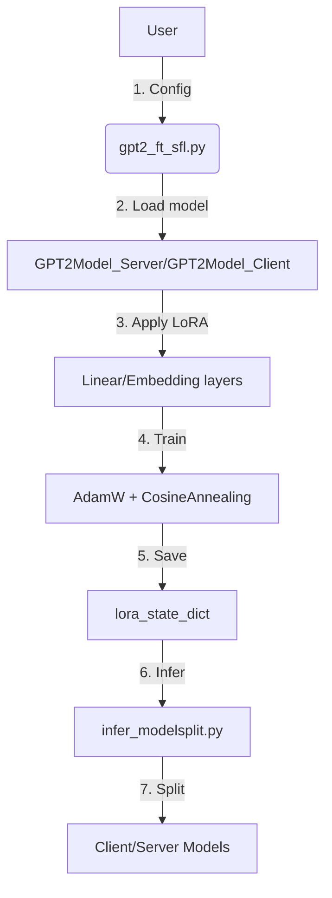
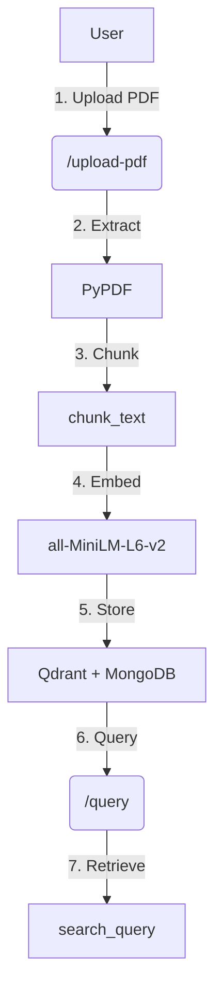

# Master Context

This codebase is a hybrid AI system combining **SplitFM** (a privacy-preserving fine-tuning and inference framework for large language models), a **PDF semantic search engine** (FastAPI + Qdrant + MongoDB), and a **React frontend** for user interaction. The core mission is to enable edge-device-friendly fine-tuning (via SplitLoRA) and split inference (SplitInfer) while providing tools for document intelligence (PDF ingestion, chunking, embedding, and query). The system targets use cases like private model adaptation, low-resource deployment, and domain-specific document Q&A—bridging the gap between foundation models (Llama3, Qwen2-VL) and practical applications.

---

## Architecture Overview

### High-Level Components
The system is divided into four major subsystems:

1. **SplitFM** (`SplitFM-main/`):
   - **SplitLoRA**: Parameter-efficient fine-tuning for models like GPT-2, Llama3.
   - **SplitInfer**: Split model inference for edge-cloud collaboration.
   - **Key Files**:
     - `SplitInfer/infer_modelsplit.py`: Demo script for split inference.
     - `SplitLoRA/gpt2_ft_sfl.py`: Fine-tuning entry point with LoRA hyperparameters.

2. **PDF Reader LLM** (`PDF Reader/`):
   - FastAPI service for PDF uploads, chunking, embedding (MiniLM-L6), and semantic search via Qdrant + MongoDB.
   - **Key Files**:
     - `app/main.py`: FastAPI routes (`/upload-pdf`, `/query`).
     - `app/services/search.py`: Core search logic (`index_chunks`, `search_query`).

3. **Frontend** (`frontend/`):
   - React 18.3.1 app served via Nginx (Dockerized).
   - **Key Files**:
     - `src/`: React components (structure undefined; likely interacts with SplitFM/PDF Reader APIs).

4. **Clinical Dashboard** (`dashboard_auto/`):
   - Early-stage static HTML/JSON dashboard for data visualization (minimal implementation).

---

### Data Flows

#### SplitFM Workflow


#### PDF Reader Workflow


---

### Key Interactions
- **SplitFM ↔ Frontend**: Likely REST/WS calls for model fine-tuning/inference (undocumented in checkpoints).
- **PDF Reader ↔ Frontend**: FastAPI endpoints (`/upload-pdf`, `/query`) exposed to React.
- **Shared Dependencies**:
  - PyTorch (SplitFM: 1.7.1/2.4.1; PDF Reader: 2.2.2).
  - Docker (all subsystems containerized but with divergent stacks).

---

## Key Decision Log

1. **Split Model Architecture (Client/Server Divide)**
   - **Decision**: Split models into `*_Client` and `*_Server` classes (e.g., `GPT2Model_Client`, `GPT2Model_Server`).
   - **Rationale**: Enable edge-cloud collaboration by partitioning layers. Client handles input/output; server manages heavy compute.
   - **Tradeoff**: Adds network overhead but reduces edge device requirements.

2. **LoRA for Fine-Tuning**
   - **Decision**: Replace `nn.Linear`/`nn.Embedding` with `loralib.Linear`/`loralib.Embedding` in `gpt2_ft_sfl.py`.
   - **Rationale**: Parameter-efficient adaptation (freeze pretrained weights, train only low-rank matrices).
   - **Impact**: Reduces trainable parameters by ~90% for GPT-2 Medium.

3. **PDF Chunking Strategy**
   - **Decision**: Fixed-size chunks (500 tokens, 50-token overlap) in `chunker.py`.
   - **Rationale**: Balances semantic coherence and embedding granularity for Qdrant.
   - **Rationale not documented** for overlap size or tokenization method.

4. **Dockerized FastAPI + Qdrant/MongoDB**
   - **Decision**: Bundle PDF Reader as a `docker-compose` stack with three services (`api`, `mongodb`, `qdrant`).
   - **Rationale**: Simplifies local development and deployment. Qdrant chosen for vector search; MongoDB for metadata.
   - **Tradeoff**: Adds container orchestration complexity.

5. **React + Nginx Frontend**
   - **Decision**: Multi-stage Docker build with `node:20-alpine` → `nginx:1.25-alpine`.
   - **Rationale**: Optimized production image size (~50MB) with static file serving.
   - **Rationale not documented** for React 18.3.1 (vs. newer versions).

---

## Gotchas & Tech Debt

### SplitFM
- **PyTorch Version Conflicts**:
  - SplitLoRA requires **PyTorch 1.7.1+cu110** (Ubuntu 18.04).
  - SplitInfer requires **PyTorch 2.4.1**.
  - *Source*: `README.md` in `SplitFM-main/`.

- **Undocumented Split Logic**:
  - `modelsplit.py` modifies Hugging Face `transformers` but lacks comments on layer partitioning criteria.
  - *Source*: `Checkpoint-Exalt_07.md`.

- **Hardcoded Paths**:
  - Training scripts (`gpt2_ft_sfl.py`) expect data at `--train_data0` and `--train_data1`. No validation for missing files.
  - *Source*: `README.md` hyperparameters table.

### PDF Reader
- **CPU-Only Embeddings**:
  - Dockerfile installs CPU-only PyTorch (`torch==2.2.2+cpu`). Embedding generation (`all-MiniLM-L6-v2`) will be slow for large PDFs.
  - *Source*: `Dockerfile` in `PDF Reader/`.

- **No Authentication**:
  - FastAPI endpoints (`/upload-pdf`, `/query`) lack auth. Risk of abuse if exposed publicly.
  - *Source*: `app/main.py` (no `Depends` or middleware).

- **Qdrant Collection Init Race Condition**:
  - `init_collection()` in `qdrant.py` assumes the Qdrant service is ready. No retry logic on connection failures.
  - *Source*: `app/database/qdrant.py`.

### Frontend
- **Undocumented API Contracts**:
  - React app structure (`src/`) is undocumented. No evidence of API clients for SplitFM/PDF Reader.
  - *Source*: Missing `src/` details in `Checkpoint-Karan_Bihani.md`.

- **Nginx Config Assumptions**:
  - Dockerfile references a custom `nginx.conf` (not committed). Likely SPA routing rules are undefined.
  - *Source*: `Dockerfile` in `frontend/`.

### General
- **`.DS_Store` Pollution**:
  - macOS metadata files committed across `SplitFM-main/`, `frontend/`, and `src/`. Increases repo size and noise.
  - *Source*: `Checkpoint-Zwarup.md`.

- **Submodule Removal Fallout**:
  - Commit `05d4e7b` removed a submodule (hash `5da7a2ec...`) without migration notes. Builds depending on it will break.
  - *Source*: `Checkpoint-Zwarup.md`.

---

## Dependency Map

| Dependency               | Version          | Role                                                                 | Owner               |
|--------------------------|------------------|----------------------------------------------------------------------|---------------------|
| **PyTorch**              | 1.7.1/2.4.1      | Core ML framework (SplitFM). Version conflict between LoRA/Infer.   | SplitFM             |
| **Qdrant**               | (latest)         | Vector DB for PDF embeddings.                                        | PDF Reader          |
| **MongoDB**              | 6.0              | Stores PDF chunks/metadata.                                          | PDF Reader          |
| **FastAPI**              | (unspecified)    | PDF Reader backend.                                                  | PDF Reader          |
| **sentence-transformers**| all-MiniLM-L6-v2 | Generates 384-dim embeddings for PDF text.                          | PDF Reader          |
| **React**                | 18.3.1           | Frontend UI.                                                         | Frontend            |
| **Nginx**                | 1.25-alpine      | Serves React static files.                                          | Frontend            |
| **loralib**              | (unspecified)    | LoRA implementation for PyTorch.                                    | SplitFM             |
| **PyPDF**                | (unspecified)    | PDF text extraction.                                                 | PDF Reader          |
| **Docker Compose**       | (unspecified)    | Orchestrates PDF Reader services.                                   | PDF Reader          |

---

## Getting Started

### Prerequisites
1. **Tools**:
   - Docker + Docker Compose (for PDF Reader).
   - Node.js 20+ (for frontend).
   - Python 3.7–3.11 (SplitFM: 3.7.16; PDF Reader: 3.11).
   - CUDA 11.0+ (for SplitFM GPU support).

2. **Clone the Repo**:
   ```bash
   git clone <repo-url>
   cd <repo-root>
   ```

---

### PDF Reader Setup
1. **Build and Run**:
   ```bash
   cd PDF\ Reader/
   docker-compose up --build
   ```
   - Services:
     - FastAPI: `http://localhost:8000`
     - Qdrant dashboard: `http://localhost:6333/dashboard`
     - MongoDB: `localhost:27017`

2. **Test Upload**:
   ```bash
   curl -X POST -F "file=@Grandma's Bag of Stories - Grandma's Bag of Stories by Sudha Murthy.pdf" http://localhost:8000/upload-pdf
   ```

3. **Query**:
   ```bash
   curl -X POST -H "Content-Type: application/json" -d '{"query":"What is the story about?"}' http://localhost:8000/query
   ```

---

### SplitFM Setup
1. **Install Dependencies**:
   ```bash
   cd SplitFM-main/
   pip install -r requirements.txt  # [Verify] No requirements.txt found; infer from README.md:
   pip install torch==1.7.1+cu110 loralib
   ```

2. **Fine-Tune GPT-2**:
   ```bash
   python SplitLoRA/gpt2_ft_sfl.py \
     --train_data0=data/part1.txt \
     --train_data1=data/part2.txt \
     --lora_dim=4 \
     --train_batch_size=8
   ```

3. **Run Split Inference**:
   ```bash
   python SplitInfer/infer_modelsplit.py \
     --model_name=gpt2-medium \
     --device=cuda:0
   ```

---

### Frontend Setup
1. **Build React App**:
   ```bash
   cd frontend/
   npm install
   npm run build
   ```

2. **Run with Docker**:
   ```bash
   docker build -t frontend .
   docker run -p 80:80 frontend
   ```
   - Access at `http://localhost`.

---

### [Verify] Clinical Dashboard
1. **Manual Setup**:
   - `dashboard_auto/` lacks build scripts. [Verify] Expected workflow:
     ```bash
     # Hypothetical (not documented)
     python prepare_dashboard.py > data.json
     ```
   - Open `clinical_dashboard.html` in a browser.

---